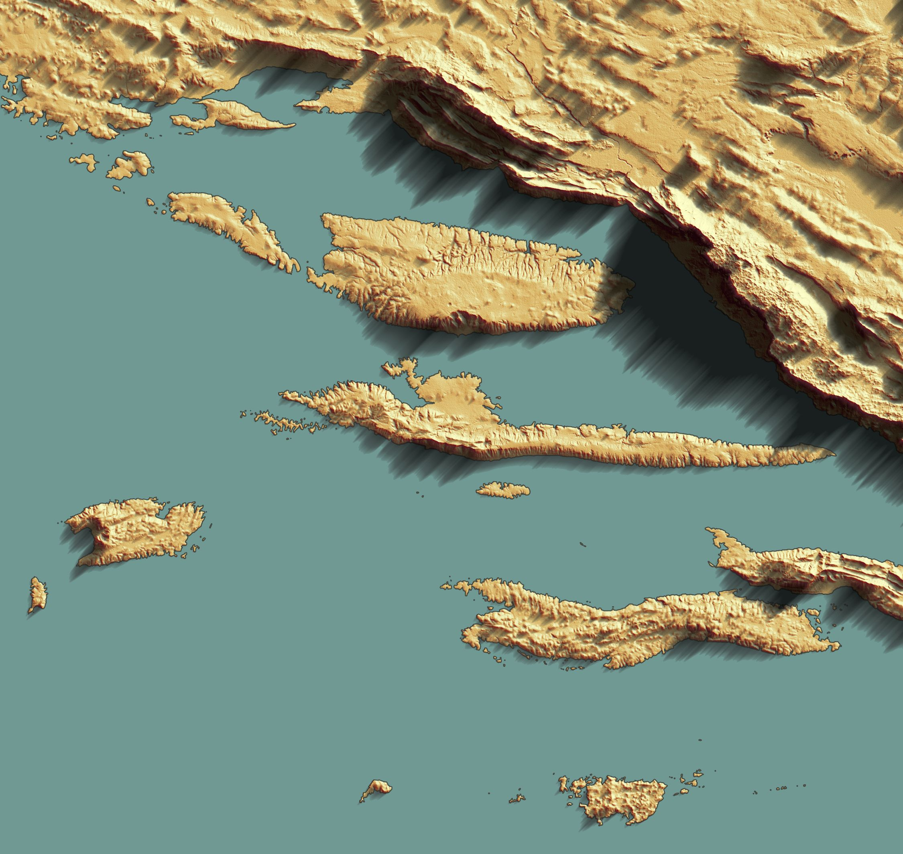

**Current stable version: 0.9** (February 2021)

**Current experimental version: 0.9.1** (March 2021)

**Supported QGIS version: 3.x**

**Repository and download: [github.com/zoran-cuckovic/QGIS-terrain-shading](https://github.com/zoran-cuckovic/QGIS-terrain-shading)**

## Installation

The algorithm for relief shading is available in the official QGIS plugin repository and can be installed as usual (In QGIS go to Plugins -> Manage and install … ). Be sure to enable experimental plugins. 

If the standard installation does not work, the plugin can be downloaded for the repository (above) and installed manually: 
First you need to locate your QGIS plugins folder. On Windows it would be ‘C:\users\username\AppData\Roaming\QGIS\QGIS3\profiles\default\python\plugins’ (or just do a file search for ‘QGIS3’ …)

Plugin code can then be extracted in a new folder inside the plugins folder (you should name the folder TerrainShading). Take care that the code is not inside a subfolder - the folder structure should be like this:

    QGIS3\profiles\default\python\plugins\
        [some QGIS plugin folders…]
        TerrainShading
            dem_shading.py
            metadata.txt
            [other files and folders…]

Finally, there is a version made as QGIS script, which can be downloaded from the [script branch](https://github.com/zoran-cuckovic/QGIS-terrain-shading/tree/script) and installed as a QGIS script. 

## Manual
Data input for both algorithms should be a digital elevation model (DEM) in raster format. Note that it has to be **projected in a metric coordinate system**. Please check the post explaining the [**problems with unprojected data (WGS84)**](https://landscapearchaeology.org/2020/wgs/), especially when considering to [open an issue](https://github.com/zoran-cuckovic/QGIS-terrain-shading/issues) in the main repository.

### Shadow depth algorithm

*Sun direction* marks the horizontal position of the Sun where 0° is on the North, 90° on the East and 270° on the West.

*Sun angle* marks the vertical position of the Sun. 

*Smooth filter* is a simple 3x3 average filter which eliminates noise and sharp transitions in the output. 

<!-- Two *analysis types* are available. The *shadow depth* will calculate the vertical difference between shadow surface and underlying terrain, while the *shadow length* will calculate the horizontal reach of the shadow. The reach is expressed as horizontal distance and not as slope length from the occlusion point to shadow tip.    -->

**Remarks** -- For cartographic uses, the best result is achieved when varying levels of transparency according to shadow depth or length. You can download and apply **QGIS style definition** files from the [style library in this repository](https://github.com/zoran-cuckovic/QGIS-terrain-shading/tree/styles).
The algorithm is explained in detail at [LandscapeArchaeology.org/2019/qgis-shadows/](https://LandscapeArchaeology.org/2019/qgis-shadows/).

<!--
The algorithm output may contain some sharp transitions or visible artefacts, especially when made for rugged terrain, over noisy elevation models, such as Lidar data, or over small scale models of urban architecture. A simple 3x3 average (smoothing) filter should be applied in these cases.   
-->

### Ambient occlusion algorithm
 
*Radius* specifies the radius of the sphere that is analysed around each data point. 

*Denoise* will apply a 3x3 average filter, as above. 

**Remarks** -- Algorithm calculation time is directly dependant on the radius of analysis.
For more information on scientific concepts behind ambient occlusion, see the [post on LandscapeArchaeology.org/2020/ambient-occlusion](https://LandscapeArchaeology.org/2020/ambient-occlusion).

### Hillshade 
This algorithm calculates surface shading - hillshade - for elevation models. The method is based on Lambert's reflectance model.

*Sun direction* and *sun angle* parmeters define horizontal and vertical position of the light source, where 0° is on the North, 90° on the East and 270° on the West.

*Bidirectional hillshade* combines a standard hillshade with one made from a perpendicular direction. IMPORTANT: this will work only when lateral terrain exaggeration is set above 1.0, preferably at 2.0 or more.

*Lateral and longitudinal exaggeration* introduce artifical deformations of the elevation model, in order to achieve higher shading contrast.

*Denoise* option is using larger search radius, producing smoother results. 

**Remarks** -- Lateral exaggeration will provide some shading to features that are parallel to the light source, and would normally remain invisible. For more details on algorithm used, see the post at [LandscapeArchaeology.org/2020/hillshade/](https://landscapearchaeology.org/2020/hillshade/).   

### Terrain position index (TPI)
Terrain position index is expressing the relative height of each elevation point within a specified radius. 
             
*Radius* is determing the search radius (in pixels).

There are 3 <b>analysis types</b>: 1) standard TPI, 2) distance weighted and 3) height weighted. Weighted options use elevation point distance or height discrepancy as weighting factor.   

*Denoise* option is applying a simple 3x3 smooth filter.

**Remarks** -- The weighted method is used to eliminate local variations, close to each elevation point, or to stress the maximum height difference. In general they produce less sharp results, but with improved contrast. 

### Texture shading 

This algorithm is based on wawelength analysis (Fourrier transform) where terrain curvature is represented as a waweform. 

*Alpha* paramter controls the impact of wawe-forms over elevation: when set to zero, pure elevation will be returned, when set to one, only the "noise" will be retained. The optimal value is approx 0.5.

**Remarks** the elevation model should not contain "NoData", i.e. empty data. These will introduce large stripes across the output raster. 

See also at [www.textureshading.com](http://www.textureshading.com).

## More information

For tutorials and in-depth discussion see: 
- [LandscapeArchaeology.org/2020/hillshade/](https://landscapearchaeology.org/2020/hillshade/) 
- [LandscapeArchaeology.org/2019/qgis-shadows](https://LandscapeArchaeology.org/2019/qgis-shadows/) 
- [LandscapeArchaeology.org/2020/ambient-occlusion](https://LandscapeArchaeology.org/2020/ambient-occlusion)

Style library can be found in the [GitHub repo](https://github.com/zoran-cuckovic/QGIS-terrain-shading/tree/styles).

You can signal an issue in [GitHub repository](https://github.com/zoran-cuckovic/QGIS-raster-shading/issues).

## Support & donations

If this piece of software makes you a happier cartographer, express your feelings and  
